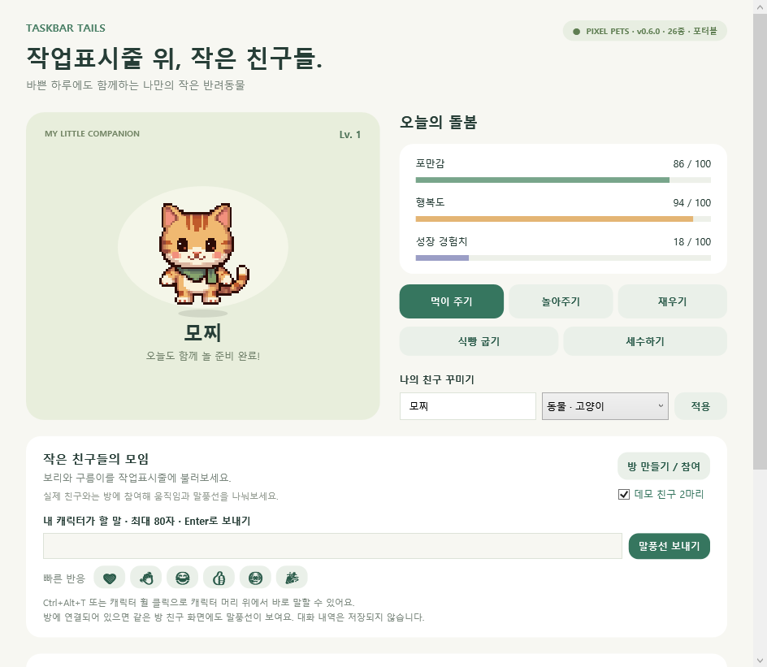

# Taskbar Tails · 작업표시줄 위의 작은 친구

<p></p>

Windows 작업표시줄 위를 걸어 다니는 픽셀 반려 캐릭터입니다. 26종의 캐릭터가 스스로 산책하고, 특수 모션을 하고, 잠들고, 친구와 같은 방에서 인사하고 공을 주고받습니다.
A pixel-art desktop companion that lives on the Windows taskbar. 26 characters walk, play, nap, and hang out with friends in shared rooms.

## 설치 · Install

- **설치판(권장)**: [Releases](https://github.com/bsj901022-web/TaskTic/releases/latest) 에서 `TaskbarTails-win-Setup.exe` 를 내려받아 실행합니다. 자동 업데이트가 됩니다. .NET 8 데스크톱 런타임이 없는 PC에서는 설치 중 한 번 자동으로 받아 설치합니다.
- **포터블**: `TaskbarTails-win-Portable.zip` (런타임 필요) 또는 `TaskbarTails-win-Portable-SelfContained.zip` (런타임 포함, 설치 불가 환경용).
- 처음 실행 시 Windows SmartScreen 경고가 나오면 "추가 정보 → 실행"을 누르세요. 코드 서명이 없는 무료 배포판이라 나오는 안내입니다.

**Installer (recommended)**: download `TaskbarTails-win-Setup.exe` from the latest release. It self-updates, and installs the .NET 8 desktop runtime once if the PC lacks it. Portable zips are also provided. On first launch, click "More info → Run" on the SmartScreen prompt.

## 기능 · Features

| | 한국어 | English |
| --- | --- | --- |
| 캐릭터 | 26종 (동물 10 · 비동물 6 · 마스코트 4 · 사람 6), 종류별 특수 모션 2가지, 100/150/200% 크기 | 26 kinds, two special motions each, 100/150/200% size |
| 돌봄 | 먹이·놀이·수면, 자리 비움 낮잠, 야간 자동 취침, 꺼져 있던 시간 반영, 50분 스트레칭 알림 | Feed, play, sleep, idle nap, night sleep, offline time, stretch reminder |
| 놀이 | 낙하산 착지, 강아지 공 놀이, 친구에게 공 던지기, 콕 찌르기, 마주치면 인사 | Parachute drop, fetch, throw a ball to a friend, poke, greetings |
| 소통 | Ctrl+Alt+T 빠른 말풍선, 빠른 반응 이모지, 방 만들기·초대코드·방 전환 | Quick bubble (Ctrl+Alt+T), reactions, rooms with invite codes and switching |
| 설정 | 한국어/English, 모니터 선택, 시작 시 실행, 전역 단축키, 효과음, 말풍선 스타일(레벨 해금) | Korean/English, monitor, start with Windows, hotkeys, sound, bubble styles |

## 문서 · Docs

- 사용 안내 (KO): [outputs/TaskbarTails-Pixel/README.md](outputs/TaskbarTails-Pixel/README.md)
- 변경 기록 · Changelog: [CHANGELOG.md](CHANGELOG.md)
- 개발 인계 노트 (KO): [outputs/작업현황.md](outputs/작업현황.md)
- 온라인 방 서버 설정 (Supabase): [outputs/TaskbarTails-Pixel/supabase](outputs/TaskbarTails-Pixel/supabase)

## 빌드 · Build

```
dotnet publish work/TaskbarTails/TaskbarTails.csproj -c Release -r win-x64 --self-contained false -o publish
publish\TaskbarTails.exe --smoke-test smoke
```

C# / .NET 8 / WPF. Sprites are generated with [PixelLab](https://www.pixellab.ai); the generation scripts and character definitions live in `work/pixellab`. Releases are built by GitHub Actions on every `v*` tag with [Velopack](https://velopack.io).

## 참고 · Notes

- 캐릭터 그림은 모두 이 프로젝트를 위해 생성한 오리지널 디자인입니다. 마스코트 4종은 인기 캐릭터 굿즈의 분위기를 참고했지만 기존 캐릭터를 복제하지 않았습니다.
- 온라인 방은 공개용 anon 키로 Supabase에 접속합니다. 말풍선과 동작은 실시간 이벤트로만 전달되고 저장되지 않습니다.
- All character art is original, generated for this project. Rooms use a public Supabase anon key; bubbles and motions are transient realtime events and are never stored.
